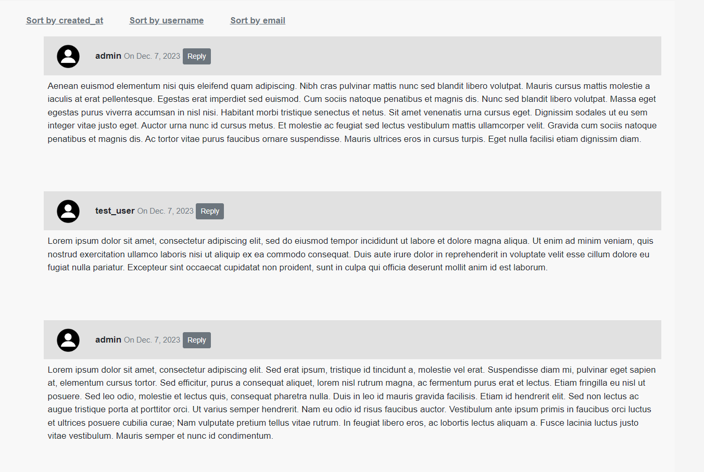
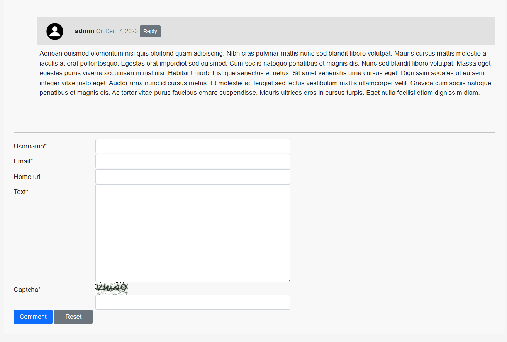
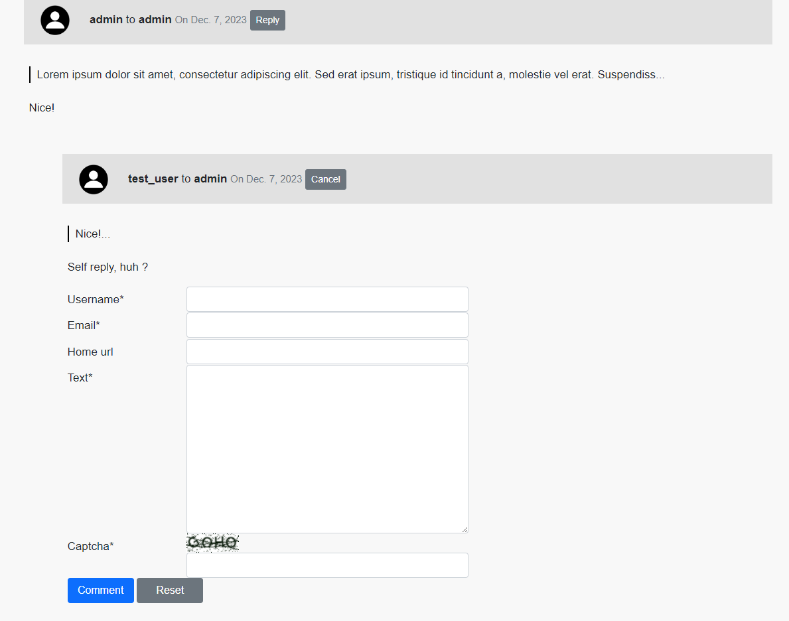

# SPA App - Commentary
App for storing and viewing leveled commentaries

# Installation

- Clone and open folder in terminal:

    ```bash
    git clone https://github.com/eduardhabryd/django-spa-comments.git
    cd django-spa-comments
    ```

For both types you need to create .env file from .env.sample and specify `DB_ENGINE='postgres'` if you want to use PostgreSQL
Default DB is SQLite

### GitHub
- install Python 3
- run these commands
    ```bash
        python -m venv venv
        venv/Scripts/activate # source venv/bin/activate for Mac/Linux
        pip install -r requirements.txt
        python manage.py makemigrations
        python manage.py migrate
        python manage.py runserver
    ```
  
### Docker
- Make sure you have installed Docker and run these commands:
  ```bash
    docker-compose up --build
  ```
  
# Features
  - User can leave commentaries and replies to other comments
  - Pagination by 25 main comments
  - Sorting by `username`, `email`, `created date` with ascending and descending order
  - Can use SQLite and PostgreSQL
  - Captcha to protect comment form
  - Allowed html tags in comment text (only `a`, `i`, `strong`, `code`)

### Demo
#### Main page

#### Form 

#### Reply form

